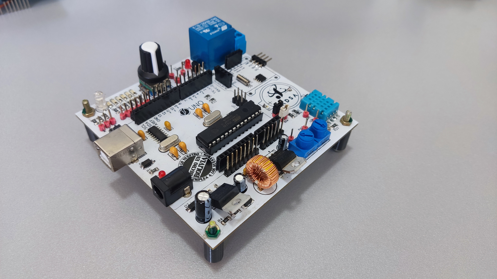

# Arduino_Trainer_Jadsa
Entrenador de Arduino para favorecer un prototipado de proyectos mas ágil y también acelerar el aprendizaje

Pueden descargar los archivos gerber o directamente pedir esta pcb: 
https://www.pcbway.com/project/shareproject/ARDUINO_TRAINER_DIY_c0c7bbe6.html

Y tienen mas información del funcionamiento y código en este video: 
https://youtu.be/5BZ6fpx1KFU
